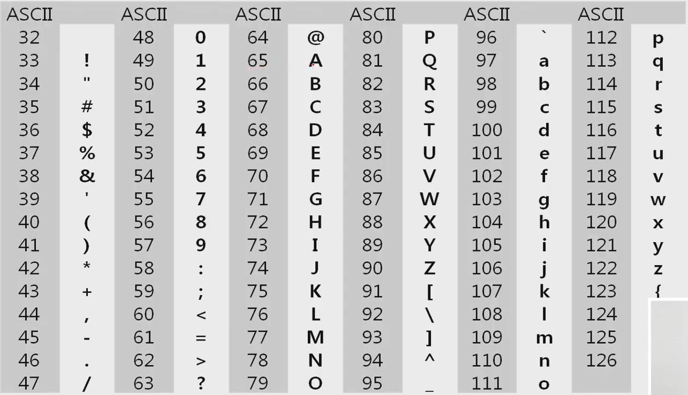

# 문자열 (String)

2020.08.24.

---

[TOC]

---


## 코드체계

> 각 문자에 대응되는 숫자를 정해 놓고 이를 메모리에 저장하는 방법

### 아스키코드

>  ASCII(American Standard Code for Information Interchange, 1967)는 <u>7bit</u> 인코딩으로 <u>영문자</u>128문자를 표현하며 33개의 출력 불가능한 제어 문자들과 공백을 비롯한 95개의 출력 가능한 문자들로 이루어져 있다. 오늘날 대부분의 컴퓨터는 문자를 읽고 쓰는데 ASCII형식을 사용한다.

`ord()` 함수 - 특정한 한 문자를 아스키 코드 값으로 변환해 주는 함수
`chr()` 함수 - 아스키 코드 값을 문자로 변환해 주는 함수 (10진수, 16진수 사용 가능)

**확장 아스키**

- 표준문자 이외의 악센트 문자, 도형 문자, 특수 문자, 특수 기호 등 부가적인 문자를 128개 추가할 수 있게 하는 부호이다.



### 유니코드

>  다국어(<u>모든문자</u>) 처리를 위한 표준. 유니코드도 다시 Character Set으로 분류되는데, 이것은 유니코드를 저장하는 변수의 크기를 정의한다. 그리고 유니코드를 바이트 순서에 대해서 표준화하기 위해서는 외부 인코딩이 필요한다.

**유니코드 인코딩 (UTF: Unicode Transformation Format)**

- `UTF-8` : web, python
- `UTF-16` : windosw, java
- `UTF-32 `: unix

python에서는 유니코드 UTF-8이 생략 가능하며, 다른 인코딩 방식으로 처리 시에는 첫 줄에 `#-*- coding: utf-8 -*-`와 같이 원하는 인코딩 방식을 지정해주면 된다.


## 문자열

> 파이썬에서는 문자열을 유니코드(UTF8)로 저장한다.

**문자열 처리**

> 파이썬에서의 문자열에는 `char` 타입이 없으며, 텍스트 데이터의 취급방법이 통일되어 있다.

- 표시 : `''`, `""`, `''''''`, `""""""`
- 연결(concatenation) `+` : `문자열 + 문자열`로 이어 붙여주는 역할
- 반복 `*` : `문자열 * 수`로 수만큼 문자열을 반복
- `indexing`, `slicing` 사용 가능
- `replace()`, `split()`, `isalpha()`, `find()` 와 같은 메소드 사용 가능

---

**문자열 뒤집기**

5가지 방법

```python
# 1. swap 이용
def str_rev(str):
    # 1단계 : str to list
    arr = list(str)
    # 2단계 : swap
    for i in range(int(len(arr)/2)):
        arr[i], arr[-1-i] = arr[-1-i], arr[i]
    # 3단계 : list to str
    str = "".join(arr)
    return str
```

```python
# 2. slicing 활용
str3 = 'goodpuppy'
print(str3[::-1])
```

```python
# 3. 하나씩 출력해서 거꾸로 붙이기
s = "Reverse this string"
s_rev = ''  # 빈 문자열
for ch in s:
    s_rev = ch + s_rev
print(s_rev)
```

```python
# 4. list의 reverse 메서드 이용
s = "Reverse this string"
s_list = list(s)
s_list.reverse()
print("".join(s_list))	# 리스트를 빈공간 없이 문자열로 합치기
```

```python
# 5. reversed 함수 이용
s = "Reverse this string"
print("".join(reversed(s)))
```

---

**문자열 비교**

> 파이썬에서는 `==` 연산자와 `is` 연산자를 사용한다. 
> (단, `==` 연산자는 내부적으로 특수 메서드 `__eq__()`를 호출)

```python
# 2개의 문자열이 서로 같은지를 비교하는 함수 정의하기
def string_compare(s1, s2):
    if len(s1) != len(s2):
        return False
    else:
        i = 0   # 초기식
        while i < len(s1):  # 조건식
            if s1[i] != s2[i]:
                return False
            i += 1  # 증감식
        return True
```

---

**문자열 정수로 변환**

>  C언어에서는 atoi 함수(array to integer)를 사용하며, 파이썬에서는 `int("123")`, `float("3.14")`와 같은 기본 함수를 제공한다.

```python
# array to integer
def atoi(str):
    value = 0
    for i in range(len(str)):
        c = str[i]
        # 정수로 된 문자열의 아스키코드 값으로 변환 후 0의 아스키 코드 값을 빼서 "정수"의 값을 반환한다.
        digit = ord(c) - ord('0')
        # 마지막에는 value에 10을 곱해 자릿수를 올려준다.
        value *= 10
    return value
```

**숫자 문자열로 변환**

>  C언어에서는 itoa 함수(integer to integer)를 사용하며, 파이썬에서는`str(123)`, `repr(123)`와 같은 기본 함수를 제공한다. `str()`는 식 그래도 나오지만, `repr()`는 `"식"`의 형태로 출력되며 주로 개발자들이 테스트 용도로 사용한다.

```python
# integer to array
def itoa(num):
    x = num # 몫
    y = 0   # 나머지
    arr = []
    while x:       # while not x == False(0):
        y = x % 10
        x = x // 10
        # 나머지 값에 0의 아스키코드 값을 더해 해당 값을 문자열로 변환해서 리스트에 추가
        arr.append(chr(y+ord('0')))
	# 뒷자리의 숫자부터 리스트에 들어갔으므로
    arr.reverse()
    # 공백 없이 리스트의 값들을 이어붙여 문자열 만들기
    str = "".join(arr)
    return str
```

- 코드의 핵심은 `%` 과 `//` 를 이용한다는 것이다.

---

**문자열 교체**

- 파이썬의 `replace()`메서드 사용하여 문자열을 교체할 수 있다.


## 패턴 매칭

```python
# 목차
1. 고지식한 패턴 검색 알고리즘 - 학습 목표
2. 카프-라빈 알고리즘 - 책에 없는 내용
3. KMP 알고리즘 - 개념만
4. 보이어-무어 알고리즘 - 개념만
```


### 고지식한 알고리즘(Brute Force)

> 본문 문자열을 처음부터 끝까지 차례대로 순회하면서 패턴 내의 문자들을 일일이 비교하는 방식의 알고리즘

```python
# 고지식한 알고리즘
def brute_force(p,t):
    # p는 pattern t는 text
    i = 0   # t의 인덱스
    j = 0   # p의 인덱스
    while j < len(p) and i < len(t):
        if t[i] != p[j]:
            i = i - j
            j = -1
        i += 1
        j += 1
    if j == len(p):
        return True
    else:
        return False
```

- `find()` 메서드를 통해서도 구할 수 있다. - 예시, `text.find(pattern)`


### KMP 알고리즘

> 불일치가 발생한 텍스트 스트링의 앞 부분에 어떤 문자가 있는지를 미리 알고 있으므로, 불일치가 발생한 앞 부분에 대하여 다시 비교하지 않고 매칭을 수행한다. 
> 패턴을 전처리하여 배열 next[M]을 구해서 잘못된 시작을 최소화한다. `시간복잡도 : O(M+N)`

- 전처리(Preprocessing): 패턴의 접두어와 접미어를 보고 되돌아갈 정보를 계산하는 것. 전처리는 실제 패턴 매칭을 하기전에 어떤 정보를 계산해두는걸 말한다.

> 

### 보이어-무어 알고리즘

>대부분의 상용 소프트웨어에서 채택하고 있는 알고리즘으로, 오른쪽에서 왼쪽(거꾸로)으로 비교하며 패턴에 오른쪽 끝에 있는 문자가 불일치 하고 이 문자가 패턴 내에 존재하지 않는 경우, 이동 거리는 무려 패턴의 길이 만큼이 된다.


*Copyright* © Song_Artish