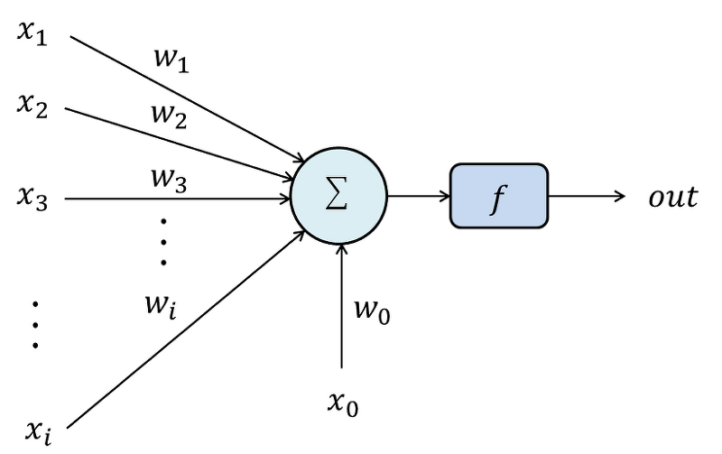
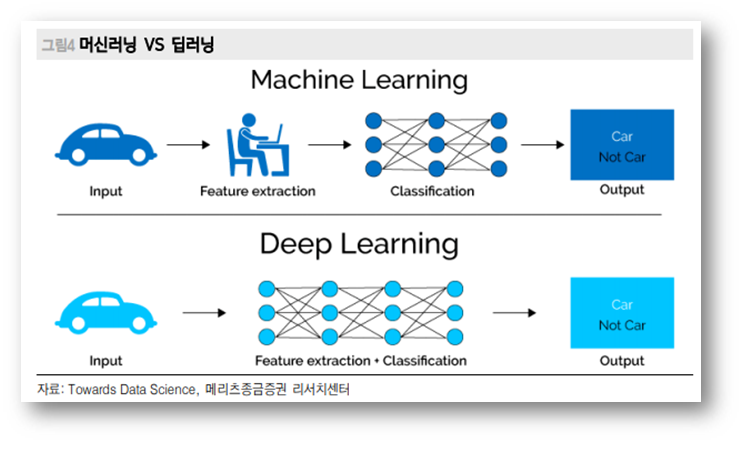

# AI 기초

> Artificial Intelligence(인공지능)

---

[TOC]

---


## History

### Perceptron

> Rosenblatt, 1958

- 1950년대부터 연구 시작
- 최초로 구현된 인공 신경망



`(출처: https://untitledtblog.tistory.com/27)`

- :ballot_box_with_check: Perceptron 1개의 모델(인공 신경망의 한 개 노드)
  - 입력 값 x에 따라 가중치 w(weight)가 별개로 존재
  - 각각의 입력 값을 서로 곱한 후 (x * w) 더하여 (sigma)
  - (if문 분기) 일정 값이 넘으면 다음 단계에 신호를 전달해주고, 아니면 신호를 버리는 구조
- :white_check_mark: 하지만 Perceptron만으로는 XOR 문제도 풀 수 없다는 이야기 때문에, AI의 겨울이 찾아오게 됨

### LeNEt-5

> Lecun et al., Proceedings of the IEEE 1998

- 첫 번째 컨볼루션 기반 뉴럴넷 by Yann Lecun, 1998
- 영상의 특징을 이용하기 위해서 **convolution operaiotn** 사용
  - 일부 영역을 정해 해당 영역마다 별개의 weight를 사용
  - 이러한 영역을 **슬라이딩 윈도우**를 거치며 재사용
  - 이 재사용으로 성능/속도 향상 및 학습의 용이성에 기여
- 우편번호 인식에 큰 성공을 거둠


`(출처: https://arnabfly.github.io/arnab_blog/lenet4/)`

### AlexNet(NIPS2012)

> `Convolutional Neural Networks`

- 딥러닝의 혁신
- 대량의 데이터를 input으로 주어 기계가 직접 학습하야 알고리즘을 개발하게 함
- 게임에만 사용했던 GPU를 기계 학습에 사용하여 연산 능력을 개선



`(출처: https://hyeonjiwon.github.io/machine%20learning/ML-1/)`

- 결국 인간이 `특징 추출`을 하는 것보다 AI가 직접 하게 하는 것이 효과적이다.


## Concept

> 기계 지능을 다루는 컴퓨터 공학 분야

### 지각능력

- (입력, 출력) 데이터
- 인간은 자라면서, 상호작용을 하면서 세상을 배움
- 인간처럼 multi-modal의 상호관계성으로부터 유용한 정보 수집
- 기계가 세상을 인식하는 방법을 개발하는 것은 아직 활발한 연구 분야 

### 강화학습

> 지각 능력을 갖춘 후 다음과 같이 학습한다.

- Observe(관찰): 현상관찰, 상황 파악
  - 관찰된 **데이터**를 **모델**에 넣어준다.
- Understand(이해): 경험, 지식 기반으로 상황을 패턴화
- Evaluate(평가): 기준(사람 or 시스템/게임)에 의한 평가기준
  - **모델을 평가**한다.
  - **Loss**에 따라서 **최적화**를 진행한다.
  - 위 과정들을 여러번 반복한다.
- Deploy(적용): 최적 모델 응용
  - **좋은 결과**를 적용한다.

### :arrow_forward: 응용사례

**자연어 처리(GPT-3)**

> Generative Pre-trained Transformer 3 (GPT-3) is an autoregressive language model that uses deep learning to produce human-like text (출처: 위키백과)

**Art application**

`StyleGAN`

- target 스타일로 얼굴을 변환시켜줌

`Living Portraits`

- 인물 이미지로부터 애니메이션 생성

**텍스트로부터 이미지 생성(GPT-3)**

- description에 따라서 이미지 생성

**자율주행(RTM3D)**


## 기계학습

```markdown
### 구성요소
- 경험 사례
- 모델
- 평가 기준
```

- **계산/추론**: 함수를 주고 output이 나오도록 계산
- **최적화**: 한 세트의 (input, output)을 주고, 관계를 가장 잘 설명하는 함수를 찾는 것
- **일반화**: 본적이 없는 input 데이터로도 일관성 있는 output이 계산 가능
  - 기계학습에는 **일반화** 과정까지 포함하여야 한다.

***Copyright* © 2021 Song_Artish**