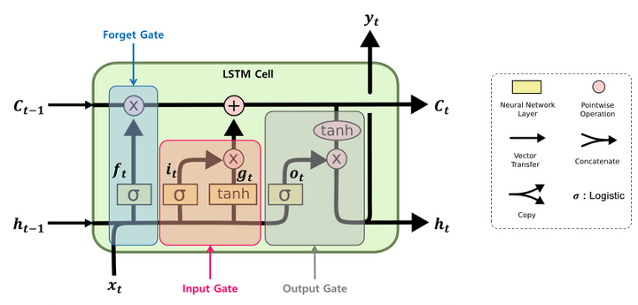

# DL Concept

> Deep Learning

---

[TOC]

---

`(출처: http://tobetong.com/?p=9393)`

## 과정

### 1. Dataset

데이터셋 준비

### 2. Pre-Processing

준비한 데이터 쌍을 모델이 처리가능한 형태로 변환

### 3. Training

데이터가 준비되면 모델 학습 진행

### 4. Validating, Saving Models

학습이 잘 진행되고 있는지 중간평가 및 로그기록으로 지속적으로 확인

### 5. Testing

학습이 완료된 후, 가장 좋은 성능을 보인 모델을 선정

## RNN

Recurrent Neural Networks

> 입력과 출력을 sequence 단위로 처리하는 모델

`(출처: https://towardsdatascience.com/recurrent-neural-networks-d4642c9bc7ce)`

| 변수 |      의미       |
| :--: | :-------------: |
|  x   |  **입력 벡터**  |
|  y   |  **출력 벡터**  |
|  h   | **(메모리) 셀** |

- RNN은 결과값을 출력층 방향뿐 아니라, 은닉층 노드의 다음 계산의 입력으로도 보내는 특징을 가지고 있다.
- 셀은 일정 기간 기억을 컨트롤하여 과거 상태와의 의존성을 제어
- 이렇게 RNN 셀을 이용하여 이전 시점들에 대한 기억을 하고, 이를 현재 시점의 출력에 반영

## LSTM

Long Short Term Memory

> RNN은 이론상 이전의 모든 time step들의 상태가 현재의 타임 스텝(t)에 영향을 줘야한다. 하지만 입력 데이터가 길어지면 학습 능력이 저하되는 현상이 나타난다. (데이터 뒤쪽으로 갈수록 앞쪽의 입력 데이터에 대한 기억을 잊어버리게됨) 이를 해결하기 위해 몇가지 게이트(gate)를 추가한 LSTM이 등장하게 되었다.

***Copyright* © 2021 Song_Artish**