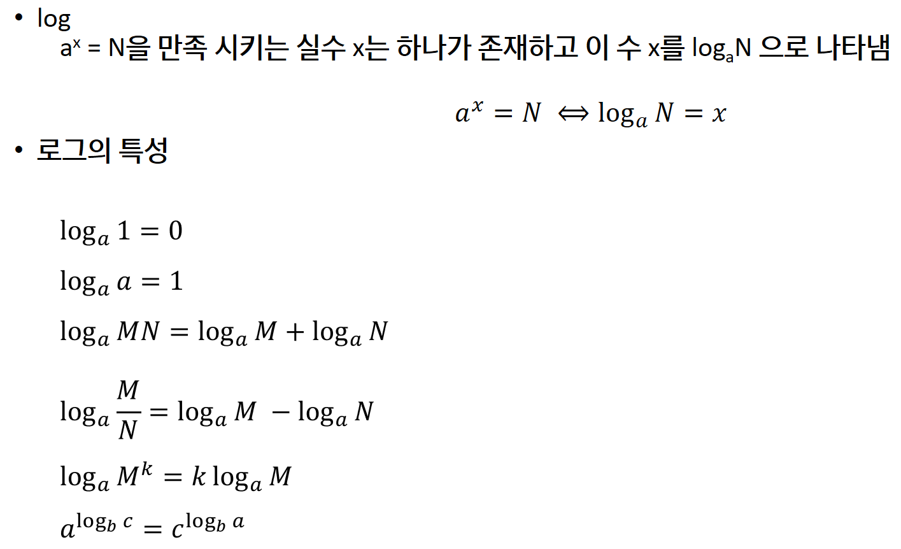
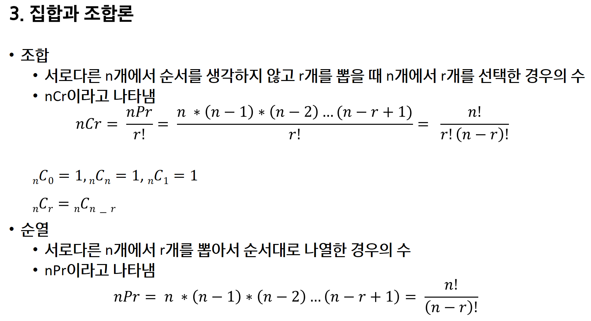

# Computational Thinking

2020.10.21

---

[TOC]

---

## 0. 서론 - 프로그래밍과 논리/수학

**Hard Logic vs. Soft Logic**

- 일상생활에서는 Soft Logic이 빠르기 때문에 유용
- 프로그래밍은 Hard Logic을 사용

## 1. 논리와 증명

### 명제

> 어떤 사고를 나타내는 문장 중에서 참(true)나 거짓(false)를 객관적이고 명확하게 구분할 수 있는 문장이나 수학적 식

**연산**

| 연산자의 이름 | 기호 |    연산자의 의미     |
| :-----------: | :--: | :------------------: |
|     부정      | `~`  |         NOT          |
|    논리곱     | `^`  |         AND          |
|    논리합     | `∨`  |          OR          |
| 배타적 논리합 |      |     Exclusive OR     |
|     조건      | `→`  |      if ~ then       |
|   쌍방 조건   | `↔`  | if and only if (iff) |

- `배타적 논리합`은 명제 p, q 중 하나만 참일 때 참이 되는 명제

**합성**

- 연산자 우선 순위 : `~` > `^` `∨` > `→` `↔`
- 항진명제 : 진릿값이 항상 참
- 모순명제 : 진릿값이 항상 거짓
- 사건명제 : 항진명제도 모순명제도 아닌 명제

### 수학적 귀납법

- 기본형 : P(1)이 참이고, P(n) → P(n+1)이 참이면 P(n)은 모든 자연수 n에 대해서 참이다.
- 강한 형태 : P(1)이 참이고, P(1) ＾ P(2) ＾ ... ＾ P(n)  → P(n+1)이 참이면 P(n)은 모든 자연수 n에 대해서 참이다.

## 2. 수와 표현

### log

## 3. 집합과 조합론

### 순열과 조합

## 4. 기초 수식

시간복잡도

## 5. 재귀

## 6. 동적 프로그래밍

## 7. 조합론 프로그래밍 과제

## 8. 기초 알고리즘 프로그래밍 과제

*Copyright* © Song_Artish