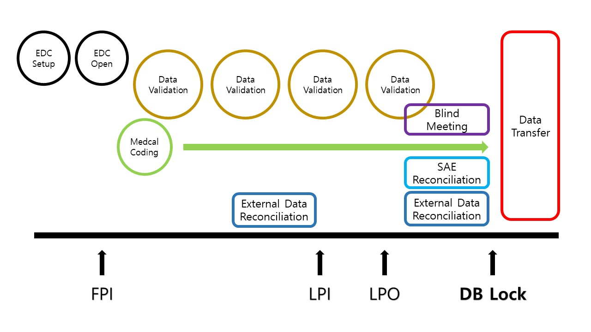

# Introduction to Clinical Trial & Data Management

2021.07.05

---

[TOC]

---


## 1. Clinical Trials

> **시장에서 시판/판매**를 위해 **규제당국의 승인을 받는 과정**

```markdown
임상시험용의약품의 **안정성**과 **유효성**을 증명할 목적으로 해당약물의 약동/약력/약리/임상적 효과를 확인하고 **이상반응을 조사**하기 위하여 사람을 대상으로 실시하는 시험 또는 연구 `(출처: 의약품안전나라)`
```


### 약품 개발 단계

1. Discovery / Screening (후보 뭃질 탐색)
   - 신약으로 개발될 가능성이 있는 물질 탐색 및 기초적인 평가 수행
2. Nonclinical Research (비임상연구)
   - In vitro/in vivo 실험 등을 통해 후보물질의 약리/독성학적 특성 등을 평가
   - 인체 투여를 위한 후보물질을 **최적화(optimization)**
3. Clinical Studies (임상시험)
   - 사람을 대상으로 후보물질의 약리학적 특성 및 안정성을 평가
   - 일반적으로 1, 2, 3상으로 구분
4. NDA reviewers (신약 승인 심사)
   - 후보물질에 대해 확보된 주요 정보를 토대로 시판 허가 여부를 심사
5. PMS (Post-marketing processes, 시판 후 과정)
   - 일반적으로 광범위하게 사용되는 상황 하에서의 안전성 정보를 추가 파악
   - 의도한 적응증 이외의 새로운 적응증을 발견

### 임상시험 주요과정

1. **IND** (Investigational New Drug)
   - 규제당국에 **임상시험 신청**
2. **Clinical Trial** (1~3단계)
   - Phase 1: 흡수/배출, 안전성
   - Phase 2: 3상을 위한 최적의 용량 확인
   - Phase 3: 의약품의 최종 확증 연구 (주로 대조군을 설정하여 비교하는 식으로 검증)
3. **NDA** (New Drug Application)
   - 임상시험결과를 규제당국에 제출하면서 **판매를 위한 승인 요청**
4. **Post Marketing(시판 후) 연구**
   - Phase 4
   - PMS (Post Marketing  Surveillance, 시판 후 조사)
   - OS (Observational  Surveillance, 관찰연구)

- 각 임상시험의 단계
  - **CSR** (Clinical Study Report): 통계에 반영하는 결과물
  - Statistical Analysis
  - Data Management (DM) + Monitoring (CRA)
  - Protocol: Clinical Trial의 planning 규칙


### Role


`(출처: 의약품안전나라)`

- Sponsor에서 CRO (Contract Research Organization)에게 계약에 의해 외주를 준다.

:ballot_box_with_check: **절차**

1. 임상시험의뢰자는 `임상시험계획서`를 작성하여 식품의약품 안전처와 실시기관 내 임상시험심사위원회(IRB)에 **승인신청**을 한다.
2. 식품의약품안전처와 실사기관 내 임상시험심사위원회(IRB)에서는 임상시험계획서를 세밀히 검토 후 **승인여부를 결정**한다.
3. 임상시험의뢰자는 신약후보물질에 대한 **안전성과 유효성을 검증**하기 위해 시험책임자에게 **임상시험 실시를 요청**한다.
4. 시험책임자는 피험자에게 임상시험에 대해 충분히 설명한 후 동의서를 받으며, 임상시험계획서에 따라 **과학적이고 윤리적인 임상시험을 진행**한다.
5. 임상시험과 관련하여 식품의약품안전처는 임상시험 실시기관, 임상시험의뢰자 시험책임자 등에 대한 **실태조사를 실시**할 수 있다.
6. 식품의약안전처의 신약후보물질의 안전성과 **유효성을 평가**하여 **신약허가 여부를 결정**하고, 신약허가를 받은 후 **판매**할 수 있다.


## 2. DM Process

> Data Management Process



|                  용어                  |                             설명                             |
| :------------------------------------: | :----------------------------------------------------------: |
|  **DMP**<br />(Data Management Plan)   |                                                              |
|    **CRF**<br />(Case Report Form)     |        - 참여 환자로부터 데이터를 수집하기 위해 사용         |
|           **FPI, LPI, LPO**            | - 비용/수익 문제 때문에 빠르게 완료하는 것이 중요<br />- 따라서, FPI, LPI, LPO가 시간적인 측면에서 중요 |
| **EDC**<br />(Electronic Data Capture) | - USR 관련 문서 생성<br />- CRF for EDC, ECS, Role & Priv. 등등 |
|          **Data Validation**           | - 입력된 데이터의 적절성 확인<br />- Real Time Validation 및 Batch Review 방식으로 진행 |
|           **Medical Coding**           |                 - text data의 categorization                 |
|    **External Data Reconciliation**    |        - External Data: CDMS 외부에서 수집되는 데이터        |
|           **Data Transfer**            |           - DB lock 완료 후, 저장된 데이터를 이관            |


***Copyright* © 2021 Song_Artish**